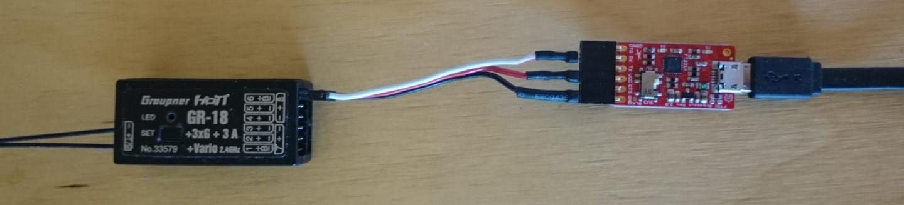
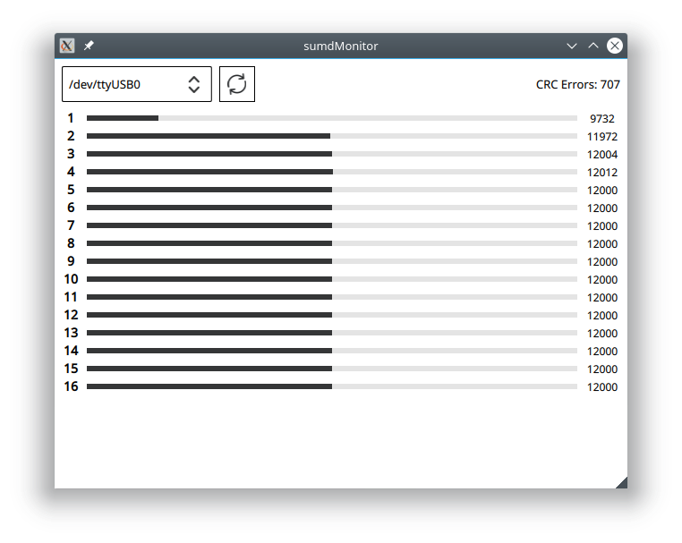

# sumdMonitor

A Qt/QML App to visualize SUMD Data from Graupner HOTT Receivers. The implementation of the protocol is written in C++ and utilize the qt-serialport modul of the Qt-Framework. The frontend is QML and is able to visualize up to 32 Channels.

SUMD was implemented as described in the following document: 
https://www.deviationtx.com/media/kunena/attachments/98/HoTT-SUMD-Spec-REV01-12062012-pdf.pdf

## Usage

Connect your ftdi or serial/usb cabel with the SUMD Port of the receiver. Reciver Signal to RX on the ftdi. Dont forget do enable sumd in the receiver/tr.

SUMD Output (Graupner GR-18 and mz-24):

### Build & Run

dependencies:
* qt5-base
* qt5-serialport

build:  
cd sumdMonitor/src  
qmake  
make

and run:  
./sumdMonitor
